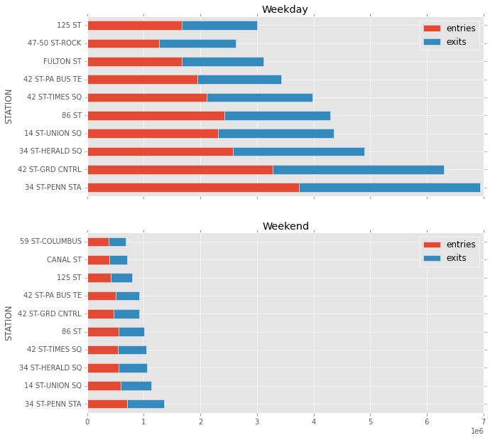
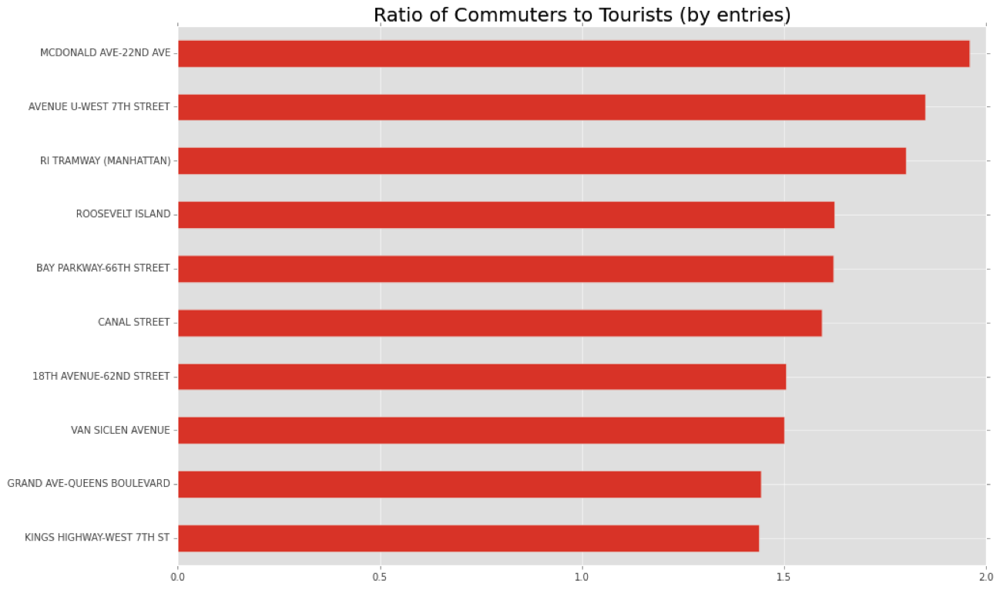
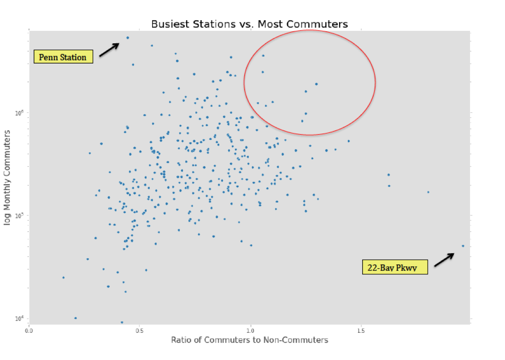
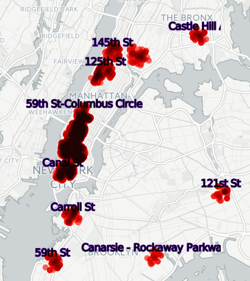
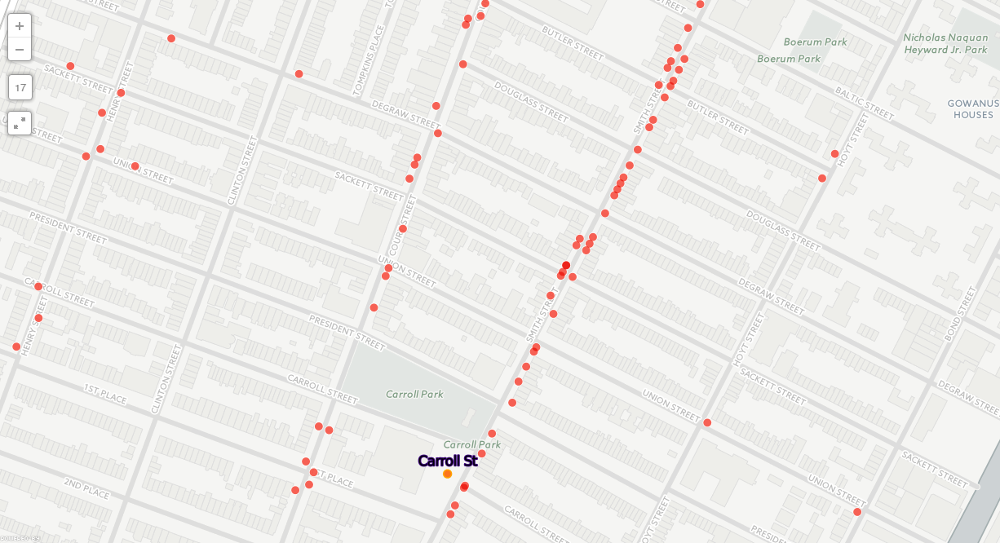

Identify ideal place and time to distribute flyers to NY residents using New York Subway data.

<!--more-->

Metropolitan Transportation Authority (MTA) is the department in New York that  deals with subway transportation.

They provide [data sets](http://web.mta.info/developers/turnstile.html) such as for each 'turnstile' in a station, how many people entered and left in a 4 hour interval.


Weekday vs Weekends
-----
Lets assume, that if we target stations with the busiest foot traffic , we can reach the most amount of people.

Here is one visualization that captures this information.




We see that compared to weekdays, the ridership is significantly less.
But not surprisingly, the stations that are the busiest on the weekdays are also busiest on the weekends.

Penn station is the busiest station, but it is also full of tourists and commuters.

Can we find out which stations have the most new yorker's coming out ?

Commuters
---------

MTA provides a [dataset](http://web.mta.info/developers/fare.html) that provides info given a station, how many paid with Full Fare, 1 Day pass, 30 day pass.

If we assume that New Yorkers have a 30 day pass, lets look at how many people who rode the subway used the commuter pass.

We defined a value called the

```
CommuterRatio = # total Travellers/#30 day travellers
```



The above chart might give an inaccurate representation because it is affected by the volume of the station. A station could have a high commuter ration

Here is a visualization that plot the commuter ratio vs the Monthly commuter volume in a station.




We see that Penn Station has a lot of traffic, but less than half have a monthly pass.

The red circle is what could be considered as stations that have a high commuter ratio and a high commuter ratio .

Now that we know the list of stations to target, what is the best place to hand out flyers?

Restaurants
--------

When people usually leave for lunch, I feel they are more likely to take a flyer.

Using Ny restaurant health inspection data from [here](https://nycopendata.socrata.com/Health/DOHMH-New-York-City-Restaurant-Inspection-Results/xx67-kt59) and the mapping service [cartodb](https://cartodb.com/), we can visualize the restaurants near some of the stations.







The repo containing my analysis can be found [here](https://github.com/stephanieleevillanueva/ds4_Benson).

This analysis was aided by my colleagues [Julia](http://jkkrieger.com/) and [Stephanie](http://stephanieleevillanueva.github.io/).
