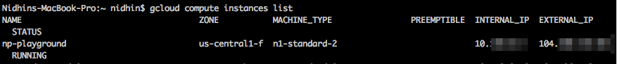

If your infrastructure is in Google Cloud , it is helpful to use the google cloud sdk.    

Here are some of the common commands I use.

<!--more-->


### Installing  

**Mac**

````bash
https://cloud.google.com/sdk/docs/quickstart-mac-os-x`

````

**Linux**
```bash
# Create an environment variable for the correct distribution
export CLOUD_SDK_REPO="cloud-sdk-$(lsb_release -c -s)"

# Add the Cloud SDK distribution URI as a package source
echo "deb http://packages.cloud.google.com/apt $CLOUD_SDK_REPO main" | sudo tee -a /etc/apt/sources.list.d/google-cloud-sdk.list

# Import the Google Cloud Platform public key
curl https://packages.cloud.google.com/apt/doc/apt-key.gpg | sudo apt-key add -

# Update the package list and install the Cloud SDK
sudo apt-get update && sudo apt-get install google-cloud-sdk

```

### List instances

```bash
gcloud compute instances list

```



### Connecting to an Instance
```bash
gcloud compute ssh <username>@<machine name> --zone <zone>

gcloud compute ssh ubuntu@np-playground --zone us-central1-f

```

### Transfer File

```bash
gcloud compute scp <user name>@<machine name>:<remote folder path> <local directory > --zone <zone> --recurse

gcloud compute scp ubuntu@np-playground:~/data . --zone us-central1-f --recurse

```


### Download File from GCloud
```bash
gsutil -m cp -r  gs://my-bucket/remotefolder dir

```


The above command, will create a  folder "remotefolder".
The folder dir needs to exist.

If you want the files to downloaded, without a folder

```bash
gsutil -m cp -r  gs://my-bucket/remotefolder/* dir

```


### Upload file to gcloud 
```bash
gsutil -m cp -r dir gs://my-bucket  

```
