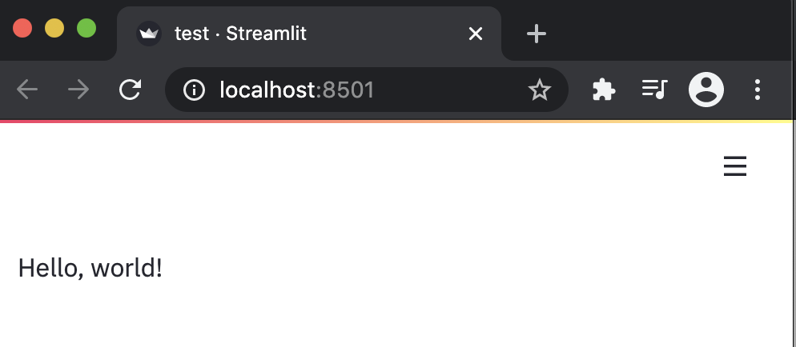
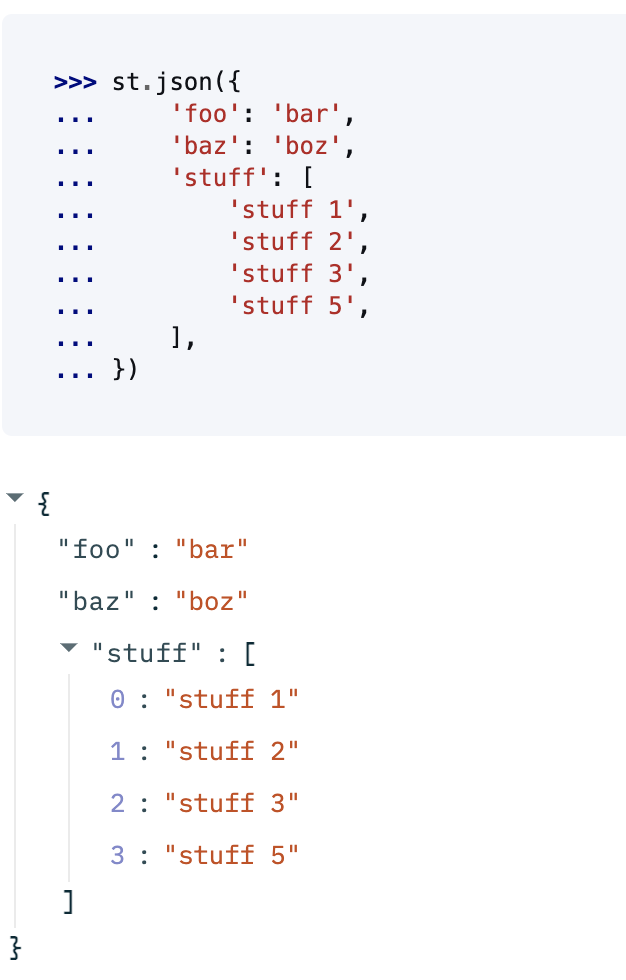
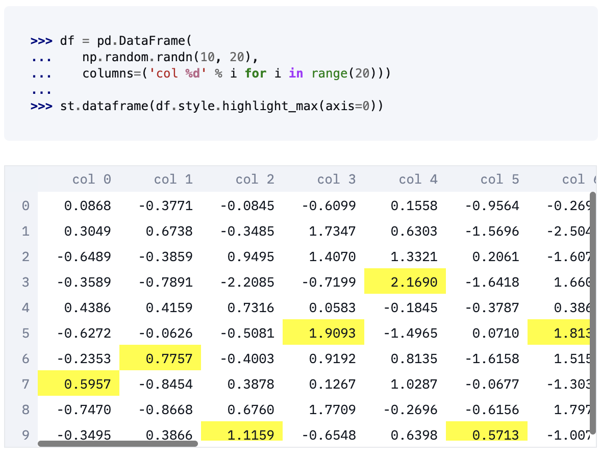
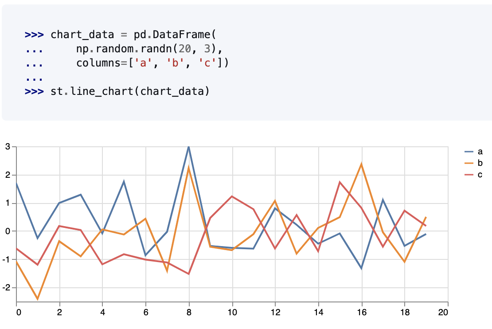
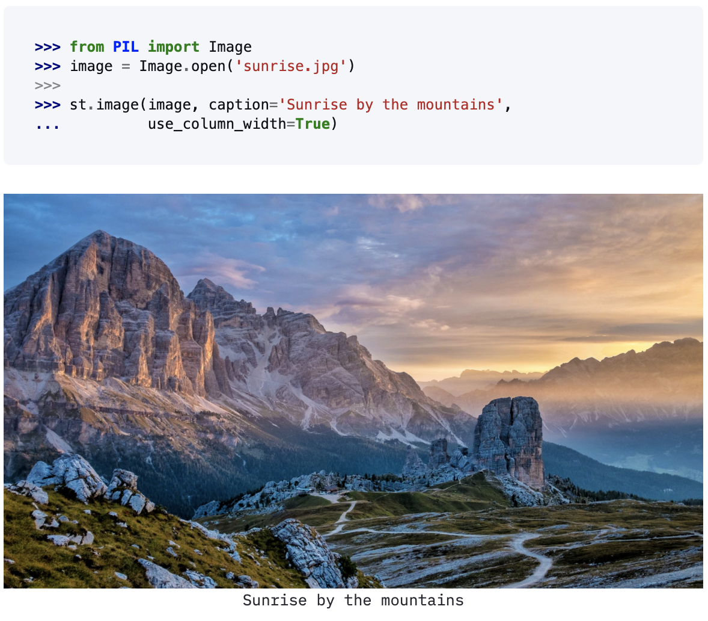
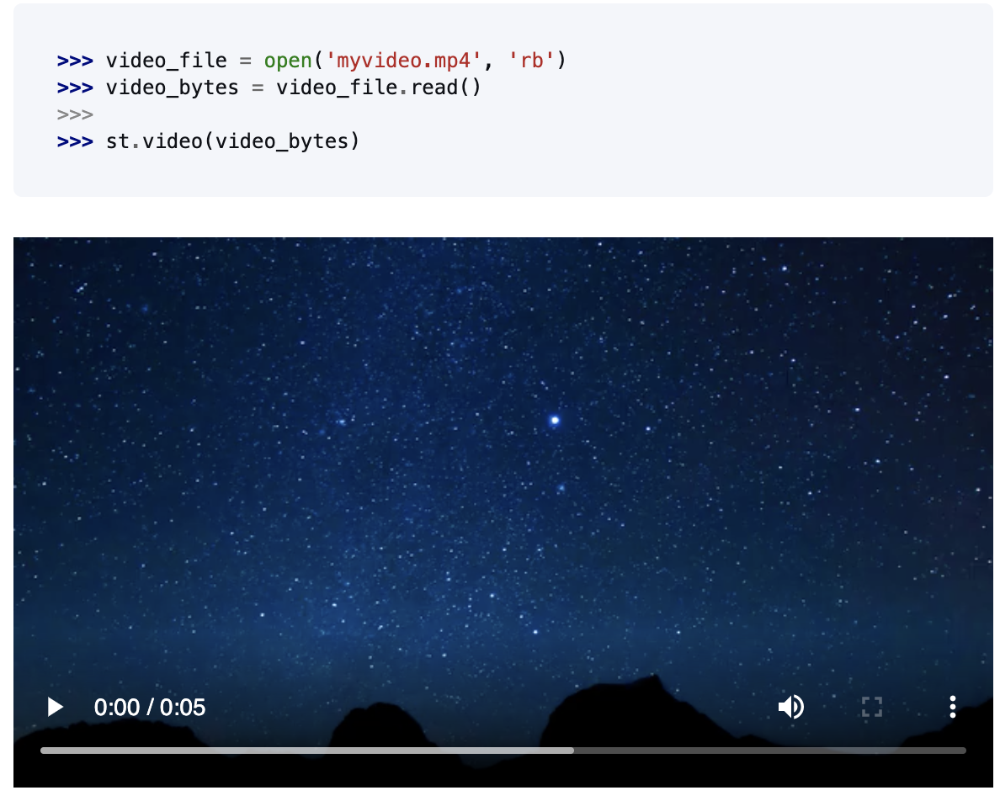

Streamlit is a useful framework for building interaction python apps.

<!--more-->

Streamlit apps are python scripts that run from top to bottom. 

Here is the code to display something in the app.

```python
import streamlit as st
st.write('Hello, world!')
```




## Displaying options

**Displaying Data**

json


dataframe


**Displaying Media**

Chart



Image


Video


**Interactive Widgets**

It supports:

- button / checkbox 
- select/ multiselect / slider
- text/numberic input / date
- file uploader

Everything is as simple as 

```python
color = st.color_picker('Pick A Color', '#00f900')
st.write('The current color is', color)
```


Apps can be run using 
```bash
streamlit run test.py
```


Here is a simple streamlit app that I build that displays a multi page app.

The Apps displaying an interactive machine learning and visualization dashboard.


Complete App in Action
