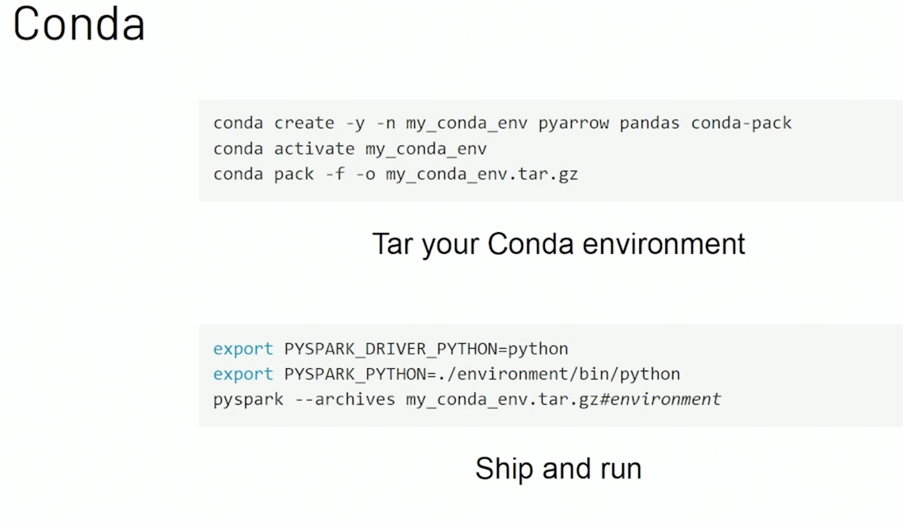
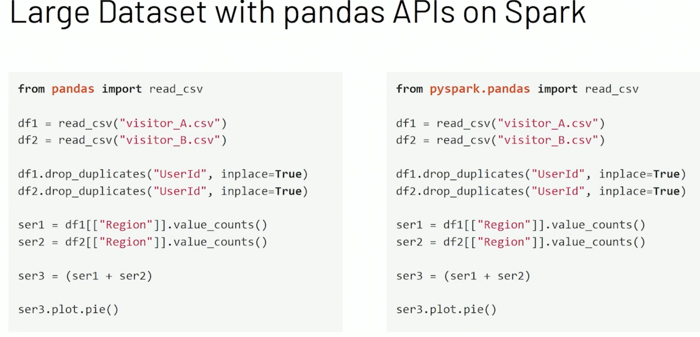

# Project Zen: Making Data Science Easier in PySpark

Project Zen Goals:
- make spark more pythonic
- better ops with python libraries

Changes:
- Python Hints
- better documentation
- support conda, pip, pipex to deploy package

Shipping pacakge in conda

- pandas Api on Spark 

- visualization

Links:
[Project Zen Databricks Blog](https://databricks.com/blog/2020/09/04/an-update-on-project-zen-improving-apache-spark-for-python-users.html)